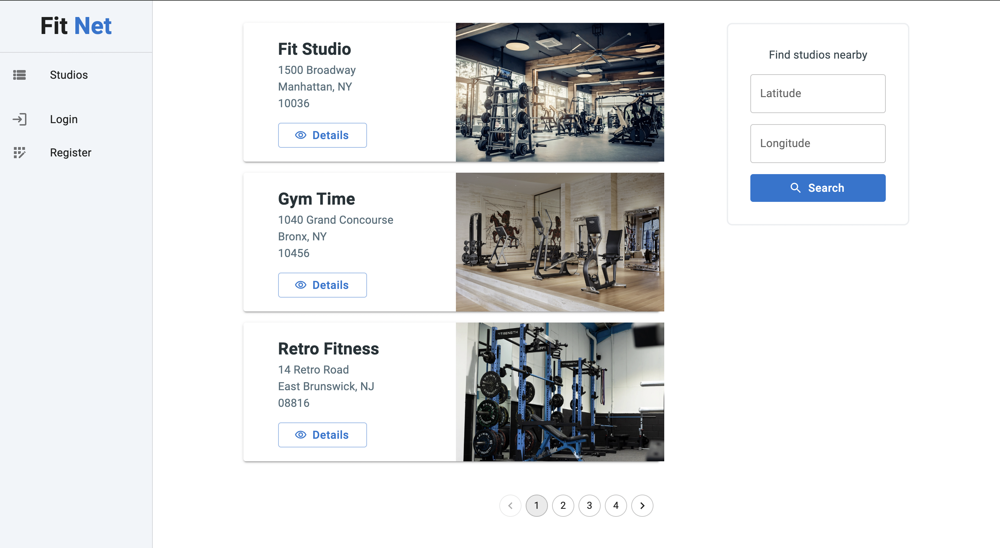
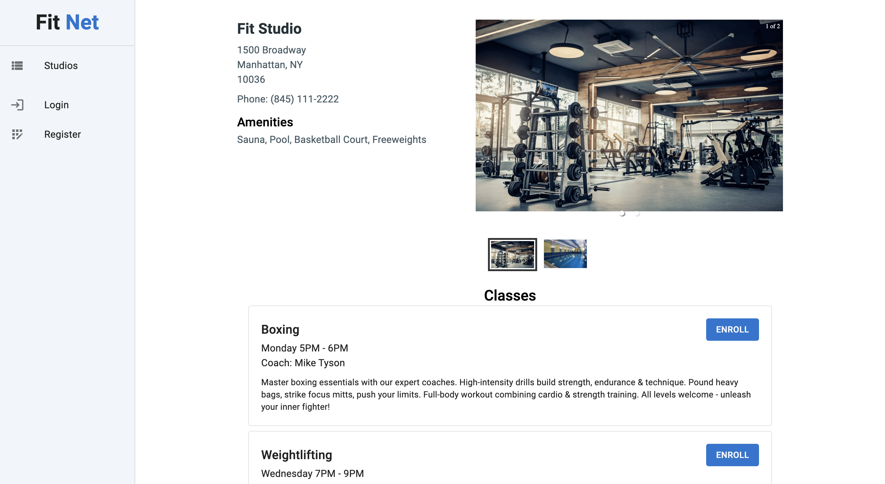

# Fit Net

## Table of Contents

- [About](#about)
- [Features](#features)
- [Technologies Used](#technologies-used)
- [Screenshots](#screenshots)

## About

Traditional gym memberships often limit users to a single location or chain, leading to inconvenience and a lack of variety. This can result in dissatisfaction, lower motivation, and ultimately, dropped memberships. People need flexibility to access different facilities that suit their changing needs.

Fit Net offers a flexible, network-based gym membership model that allows members to access a wide variety of gyms, fitness centers, and studios within a designated network. Our members will have the freedom to choose where and how they want to work out, just like visiting a doctor in a healthcare network.

## Features

- **View Studios**: A comprehensive list of all fitness studios within the network. Studios displayed with key information such as name, address, and a thumbnail image.
- **Search Nearby Studios**: Users can enter their latitude and longitude to find fitness studios nearby. The search results include distance from the user's location, sorted by proximity.
- **View Studio Details**: View a gallery of images showcasing the studio, a list of studio amenities, a list of available classes and the abilty to enroll in classes.
- **Manage Enrollments**: Users can see a list of all classes they are currently enrolled in, including class details, and have an option to unenroll from a class with a single click.

## Technologies Used

- Python and Django REST Framework
- React with TypeScript
- Material UI
- Swagger UI

## Screenshots

